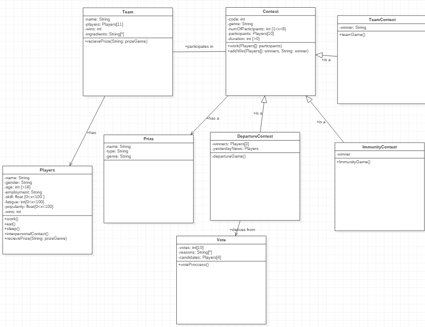

# Master Chef ObjectOriented C++

Creating a Master Chef game without graphics for Better Understanding of Object-Oriented C++ - Originally developed 01/12/2018

## In this project it was developed 
1. In the first phase of the project, we create theoretically the UML and the general classes and connections that will be used
2. In the second phase, the initial development of the classes and main functions takes place
3. In the final phase, the system of voting players and in general dynamic development takes place 

## Results of the Project 

